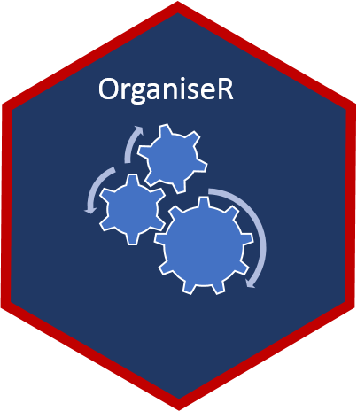
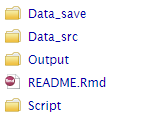
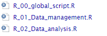

<!-- README.md is generated from README.Rmd. Please edit that file -->

```{r, include = FALSE}
knitr::opts_chunk$set(
  collapse = TRUE,
  comment = "#>",
  fig.path = "man/figures/README-",
  out.width = "100%"
)
```
# organiser

<!-- badges: start -->

[](https://www.tidyverse.org/lifecycle/#experimental)
<!-- badges: end -->



The goal of organiser is to use a single file structure convention for R project

## Installation

You can install the released version of organiser from [github](https://CRAN.R-project.org) with:

``` r
remotes::install_github("AbderrahmenDHIF/organiser")
```

## File structure

The function `add_file` creates 4 folders and a Readme file described above:

* `Data_src`:  Raw source data
* `Script`: All R scripts 
* `Data_save`: Intermediate data objects. Typically, I save these as RDS files (with `saveRDS` and  `readRDS`) 
* `Output`: The final output. Typacally, is a html file generated by Rmarkdown
* `README.Rmd`: Describes the project



## Script structure

The `Script`folder contains 3 R scripts described above:

* `R_00_global_script`: 
* `R_01_Data_management`:
* `R_02_Data_analysis`:




## Example


```{r example, eval=FALSE}
library(organiser)
## add files
add_file()
## add script
add_script("name_of_script")
```

