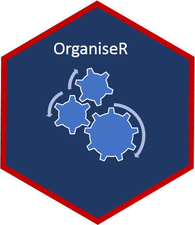
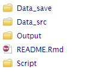
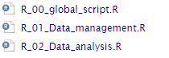

<!-- README.md is generated from README.Rmd. Please edit that file -->
organiser
=========

<!-- badges: start -->
[](https://www.tidyverse.org/lifecycle/#experimental) <!-- badges: end -->



The goal of organiser is to use a single file structure convention for R project

Installation
------------

You can install the released version of organiser from Github with:

``` r
# install.packages("remotes")
remotes::install_github("AbderrahmenDHIF/organiser")
```

File structure
--------------

The function `add_file` creates 4 folders and a Readme file described above:

-   `Data_src`: Raw source data
-   `Script`: All R scripts
-   `Data_save`: Intermediate data objects. Typically, I save these as RDS files (with `saveRDS` and `readRDS`)
-   `Output`: The final output. Typacally, is a html file generated by Rmarkdown
-   `README.Rmd`: Describes the project



Script structure
----------------

The `Script`folder contains 3 R scripts described above:

-   `R_00_global_script`: Fixing paramters, loading libraries and sourcing scripts
-   `R_01_Data_management`: Preparing data for analysis (e.g. cleaning data, creating features ...)
-   `R_02_Data_analysis`: Transforming data into information (e.g. aggregation, tidying ...)



Example
-------

Create an R project first, then you can use the exemple above

``` r
library(organiser)
## create the file and the script structure described below
add_file()
## create an additional script inside the script folder
add_script("name_of_script")
```
